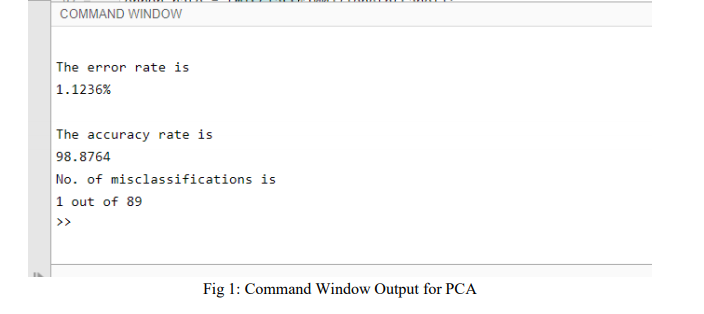
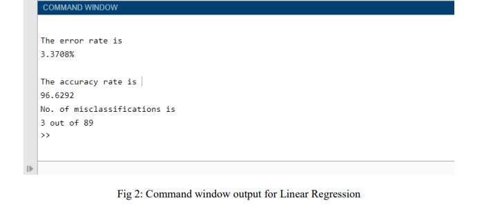
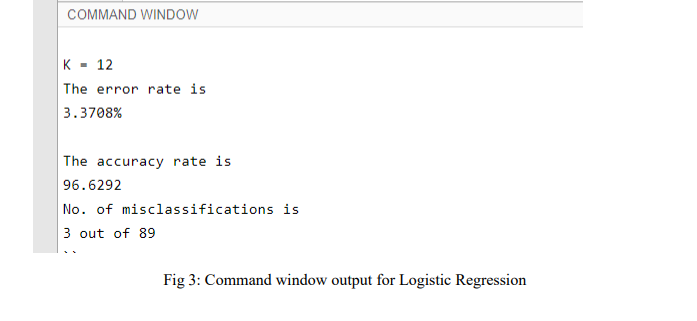

# Comparison of PCA, Linear Regression and Logistic Regression method in terms of accuracy and error rate for breast cancer dataset :metal:

In this project, I will be analyzing the efficiency of Principal Component Analysis, Linear Regression and Logistic Regression Method and comparing it in terms of error rate and number of misclassifications. I will be considering WDBC (Wisconsin Diagnostic Breast Cancer) dataset. The dataset has 30 features selected from each of 569 patients of which 357 patients were diagnosed as benign and 212 patients were diagnosed as malignant.

## Data :cloud:
WDBC (Wisconsin Diagnostic Breast Cancer) dataset

## Methods and Software used :computer:
MATLAB  
Principal Component Analysis  
Linear Regression  
Logistic Regression

## Insights :pencil:

